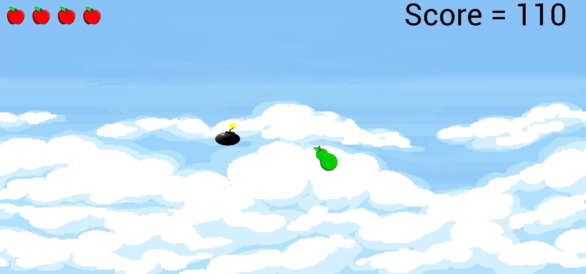

# Basic Fruit Ninja (Java + libGDX)

A lightweight Fruit Ninja–style slicing game built with libGDX. This repo is organized as a typical libGDX multi-module project:

- `core`: cross-platform game logic, assets usage, and rendering
- `android`: Android launcher and packaging

The Android app id is `com.recep.basicfruitninja` with minSdk 21 and target/compile SDK 36.

## Features

- Fast, touch-driven slice mechanics
- libGDX rendering and input handling
- Box2D physics (via libGDX) wired in the `core` module
- TrueType font rendering using gdx-freetype
- ARM/x86 native libraries packaged automatically for Android

## Gameplay

- Swipe across the screen to slice flying fruits with quick finger drags.
- Chain combos by slicing multiple fruits in a single swipe to earn bonus points.
- Try not to miss fruits; depending on the level rules, hazards (like bombs) may penalize you.

## Screenshot



## Tech stack

- Java 17 for Android module (toolchain for non-Android modules is set to Java 23)
- libGDX: `gdx`, `gdx-box2d`, `gdx-freetype`
- Android Gradle Plugin 8.x
- Gradle build with tasks for asset indexing and packaging natives

## Project structure

```
BasicFruitNinja/
├─ android/            # Android application module
│  ├─ src/main/AndroidManifest.xml
│  ├─ res/             # Android resources (icons, values, etc.)
│  ├─ libs/            # Extracted native .so files (generated)
│  └─ build.gradle
├─ core/               # Shared game code (libGDX)
│  └─ build.gradle
├─ assets/             # Game assets (referenced by libGDX)
│  └─ assets.txt       # Auto-generated at build
├─ build.gradle        # Root Gradle config
├─ settings.gradle     # Includes :android and :core modules
└─ gradle.properties   # Version and libGDX settings
```

## Requirements

- Android Studio (latest stable) with Android SDK
- JDK 17 installed and configured in Android Studio
- Android SDK 36 (compile/target); device/emulator with API 21+ (minSdk)

## Getting started

### Option A: Android Studio (recommended)

1. Open the project folder in Android Studio.
2. Let Gradle sync finish (downloads dependencies like libGDX).
3. Connect a device or start an emulator (API 21+).
4. Run the `android` configuration.

### Option B: Command line (Windows PowerShell)

From the repo root:

```pwsh
# Build debug APK
.\gradlew.bat :android:assembleDebug

# Install on connected device/emulator
.\gradlew.bat :android:installDebug

# Start the app using the provided Gradle task
.\gradlew.bat :android:run
```

Notes:
- The `:android:run` task uses ADB to start `com.recep.basicfruitninja/.android.AndroidLauncher`.
- If you see SDK path issues, ensure `local.properties` contains `sdk.dir=...` or that `ANDROID_SDK_ROOT` is set.

## Assets

- Place game assets in the top-level `assets/` folder.
- A small Gradle task generates `assets/assets.txt` listing all assets at build time (used by some libGDX workflows).

## Build details

- Android module
  - namespace/appId: `com.recep.basicfruitninja`
  - compileSdk: 36, targetSdk: 36, minSdk: 21
  - Java compatibility: 17 (with desugaring)
  - ProGuard/R8 minification enabled for release builds
- Packaging
  - Native libraries for ARMv7, ARM64, x86, x86_64 are extracted into `android/libs/` automatically via the `copyAndroidNatives` task.

## Troubleshooting

- Gradle sync errors: Update Android Studio/Gradle, check network access to Maven repositories.
- SDK not found: Set `sdk.dir` in `local.properties` or define `ANDROID_SDK_ROOT`.
- ADB/device not found: Verify `adb devices` lists your device; enable USB debugging; for emulator, ensure it’s running.
- Java version mismatch: Android module compiles with Java 23; if your global JDK differs, configure the JDK per module in Android Studio.

## Contributing

- Issues and PRs are welcome. For larger changes, please open an issue first to discuss the approach.

## License

This project is licensed under the MIT License — see the [LICENSE](LICENSE) file for details.

## Acknowledgments

- Built with the excellent [libGDX](https://libgdx.com/) game framework.
